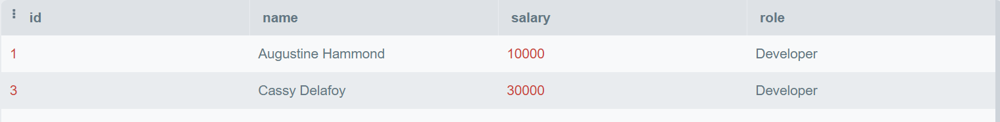
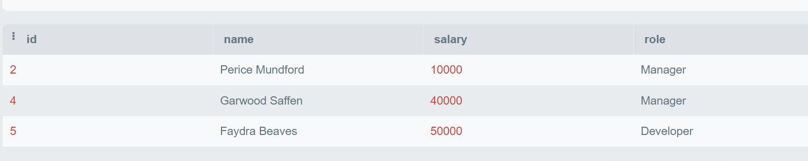
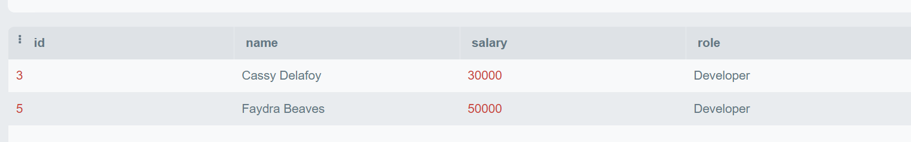
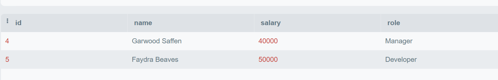

# SQL-Lab2

# We will use the Employees and Awards table below:

 

### Q1: Choose all employees who have received an award (Nested Query)?
Query: SELECT * FROM employee WHERE id IN (SELECT employee_id From Awards );

Output: 
 

### Q2: Choose all employees who have never received an award (Nested Query)?
Query: SELECT * FROM employee WHERE id NOT IN (SELECT employee_id From Awards );

Output: 

 
### Q3: Choose all Developers who make more than all Managers combined (Nested Query)?
Query: SELECT * FROM employee WHERE role = "Developer" and salary > (SELECT MAX(salary) From employee WHERE role = "Manager" );

Output: 

 
### Q4: Choose all Developers who make more money than any Manager (Nested Query)?
Query: SELECT * FROM employee WHERE role = "Developer" and salary > (SELECT salary From employee WHERE role = "Manager" );

Output: 

 
### Q5: Choose all employees whose salaries are higher than the average for their position. (Nested Query)?
Query: SELECT * FROM employee WHERE salary > (SELECT AVG(salary) From employee GROUP BY "role");

Output: 
